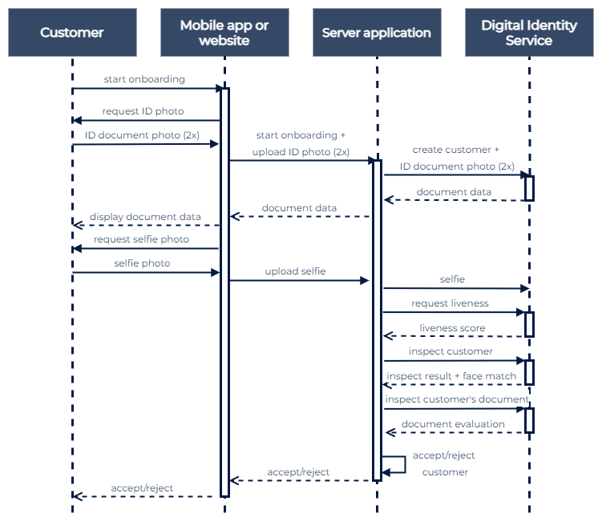

# API Quick Guide
### Get up and running with our API and start developing your Verifili integration.

Integrating Verifili into your app or website requires only two steps:
## Step 1: Obtain your API keys
Verifili authenticates your API requests using your Access Token. If you do not include your Token when making an API request or use one that is incorrect or expired, Verifili returns an error.

## Step 2: Make a test API request
To check that your integration is working correctly, make a test API request:
```
curl -X 'GET' \
  '<API_url>' \
  -H 'Authorization: Bearer <access_token>
```
Replace `<API_url>` and `<access_token>` with API URL and your Access Token.
Verifili returns a response to your API request.
```
{
  "Welcome": "you are in Verifili API",
  "version": "1.0"
}
```
Once you have successfully made an API request, you’re ready to begin integrating Verifili.

## Perform Onboarding Process

### Overview of flow



### 1. Create a new customer
The first step in creating any check is to create a client from your backend server. you need to provide their full name and Email. (Only the name is required).

To create a new customer, use the following command:
```
curl -X 'POST' \
  '<API_url>/api/v1/customers/' \
  -H 'Authorization: Bearer <access_token>' \
  -H 'Content-Type: multipart/form-data' \
  -F 'customer_name=<customer_name>' \
  -F 'email=<email>'
```
Replace `<API_url>`,`<access_token>`, `<customer_name>`, and `<email>` with the appropriate values.
### Example response
The response will contain an id (the Customer ID). It is required for the next step.
```
{
  "id": "01HGR7Z0GTBGJ5AWWFQYQETAS4"
}
```
### 2. Create a document authentication and verification for a customer
Create a document by providing the Client ID and document type (e.g. idcard, passport) then Upload front side image and back side of an ID, both sides of the ID are required. 

Images should be JPG or PNG and between 34 KB and 4 MB in size.

To create a new document for a customer, use the following command:
```
curl -X 'POST' \
  '<API_url>/api/v1/customers/<customer_id>/' \
  -H 'Authorization: Bearer <access_token>' \
  -H 'Content-Type: multipart/form-data' \
  -F 'type=<document_type>' \
  -F 'front_ID=@<path_to_front_ID>' \
  -F 'back_ID=@<path_to_back_ID>'
```
Replace `<API_url>`,`<access_token>`, `<document_type>`, `<path_to_front_ID>`, `<path_to_back_ID>`, and `<customer_id>` with the appropriate values.

### During this request, Verifili will perform the ID Document check. You can retrieve a check's outcome and breakdown via the API.

### Example response
```
{
  "status": "mrz verified"
}
```

### 3. Create a selfie authentication for a customer
Create a document by providing the Client ID and Upload a live selfie photo.

To create a new selfie for a customer, use the following command:
```
curl -X 'POST' \
  '<API_url>/api/v1/customers/<customer_id>/selfie/' \
  -H 'Authorization: Bearer <access_token>' \
  -H 'Content-Type: multipart/form-data' \
  -F 'selfie=@<path_to_selfie>'
```
Replace `<API_url>`,`<access_token>`, `<path_to_selfie>`, and `<customer_id>` with the appropriate values.

### Example response
```
{
  "status": "completed"
}
```
### 4. Provide a document page for a customer
If document authentication and verification fail for the reason one of the images is not accepted, you can fix it without reinscription, by uploading the target image side.

To provide a document page for a customer, use the following command:
```
curl -X 'PUT' \
  '<API_url>/api/v1/customers/<customer_id>/document' \
  -H 'Authorization: Bearer <access_token>' \
  -H 'Content-Type: multipart/form-data' \
  -F 'type=<document_type>' \
  -F 'page_type=<page_type>' \
  -F 'page=@<path_to_page>'
```
Replace `<API_url>`,`<access_token>`, `<document_type>`, `<page_type>`, `<path_to_page>`, and `<customer_id>` with the appropriate values.

### 5. Provide a selfie for a customer
If selfie authentication fails for the reason the image is not accepted, you can fix it without reinscription, by uploading the selfie image.

To provide a selfie for a customer, use the following command:
```
curl -X 'PUT' \
  '<API_url>/api/v1/customers/<customer_id>/selfie/' \
  -H 'Authorization: Bearer <access_token>' \
  -H 'Content-Type: multipart/form-data' \
  -F 'selfie=@<path_to_selfie>'
```
Replace `<API_url>`,`<access_token>`,`<path_to_selfie>`, and `<customer_id>` with the appropriate values.

### 6. Get a customer's inspection
You can retrieve a check's outcome and breakdown via the API by providing the Client ID.

To provide a selfie for a customer, use the following command:
```
curl -X 'GET' \
  '<API_url>/api/v1/customers/<customer_id>' \
  -H 'Authorization: Bearer <access_token>'
```
Replace `<API_url>`,`<access_token>`, and `<customer_id>` with the appropriate values.

### Example response
```
{
  "full_name": <full_name>,
  "company": "verifili",
  "status": "completed",
  "created_date": "2023-12-03 16:25:11.964264",
  "updated_date": "2023-12-03 18:42:21.536928",
  "document_authenticity": {
    "FRONT_Side_LivenessScore": <Accuracy>,
    "BACK_Side_LivenessScore": <Accuracy>
  },
  "mrz": {
    "Decision": <true or false>,
    "accuracy": <Accuracy>,
    "Checking": {
      "ID_TYPE": <ID_TYPE>,
      "FIRST_NAME": <FIRST_NAME>,
      "FAMILY_NAME": <FAMILY_NAME>,
      "ID_NUMBER": <ID_NUMBER>,
      "BIRTHDAY": <BIRTHDAY>,
      "GENDER": <GENDER>,
      "AGE":  <AGE>,
      "EXPIRY_DATE": <EXPIRY_DATE>,
      "NATIONALITY": <NATIONALITY>,
      "ISSUING_NATIONALITY": <ISSUING_NATIONALITY>,
      "EXPIRY_HASH": <EXPIRY_HASH_DIGIT>,
      "BIRTH_DATE_HASH": <BIRTH_DATE_HASH_DIGIT>,
      "DOCUMENT_NUMBER_HASH": <DOCUMENT_NUMBER_HASH_DIGIT>,
      "FINAL_HASH": <FINAL_HASH_DIGIT>
    },
    "mrz": <MRZ_ZONE>},
  "selfie_inspection": {
    "verified": <true or false>,
    "Similarity": <Accuracy>,
    "gender_estimation": <Male or Female>,
    "age_estimation": <EXPECTED_AGE>
  },
  "images": { “portrait”: '<BASE64_DATA_CONTENT>',
	“"Selfie”: '<BASE64_DATA_CONTENT>' ,
	“back_side”: '<BASE64_DATA_CONTENT>',
	“front_side”:'<BASE64_DATA_CONTENT>',
	“mrz”: '<BASE64_DATA_CONTENT>’ 
           }}
```
### 7. Get a customer's selfie image
To get a customer's selfie image, use the following command:
```
curl -X 'GET' \
  '<API_url>/api/v1/customers/<customer_id>/selfie/' \
  -H 'Authorization: Bearer <access_token>'
```
Replace `<API_url>`,`<access_token>` and `<customer_id>` with the appropriate values.
### Example response
```
<BASE64_DATA_CONTENT>
```
### 8. Get a customer's portrait image
To get a customer's portrait image, use the following command:
```
curl -X 'GET' \
  '<API_url>/api/v1/customers/<customer_id>/document/portrait' \
  -H 'Authorization: Bearer <access_token>'
```
Replace `<API_url>`,`<access_token>` and `<customer_id>` with the appropriate values.
### Example response
```
<BASE64_DATA_CONTENT>
```

### 9. Get a document page for a customer
To get a document page for a customer, use the following command:
```
curl -X 'GET' \
  '<API_url>/api/v1/customers/<customer_id>/document/pages/<page_type>' \
  -H 'Authorization: Bearer <access_token>'
```
Replace `<API_url>`,`<access_token>`,`<page_type>` and `<customer_id>` with the appropriate values.
### Example response
```
<BASE64_DATA_CONTENT>
```


